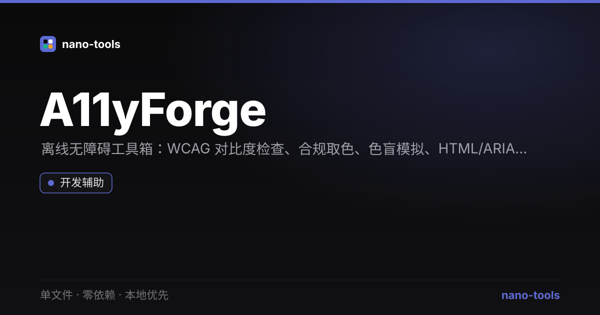

# A11yForge · 离线无障碍工具箱

本地优先的无障碍（Accessibility）工具箱——WCAG 对比度检查、合规取色、色觉障碍模拟、HTML/ARIA 审计，**零第三方依赖、零上传、完全离线**。nano-tools 矩阵第 15 旗舰。



## 功能
- **对比度检查**：前景 / 背景取色，实时显示 WCAG 2.1 对比度比值，并判定 AA/AAA（普通文本 / 大字·UI 组件）是否达标。
- **合规取色**：一键把前景色微调到满足 AA 普通文本（≥4.5）的最近合规色。
- **色觉障碍模拟**：以红 / 绿 / 蓝三色盲（Protanopia / Deuteranopia / Tritanopia）矩阵模拟当前配色在色觉缺陷人群眼中的呈现。
- **HTML / ARIA 审计**：粘贴 HTML 片段，自动发现：
  - `<html>` 缺少 `lang`
  - 重复 `id`
  - `` 缺少 `alt`
  - 表单控件缺少可访问名称（`aria-label` / `label[for]`）
  - 标题层级跳跃（如 h1 → h3）
  - `tabindex` 为正值（反模式）
  - `aria-hidden="true"` 用在可聚焦元素上
- **报告导出**：一键下载 / 复制纯文本审计报告（对比度 + 审计汇总）。

## 纯函数 API（可被 Node 测试调用）
工具脚本以 `module.exports` 暴露以下纯函数，便于自动化与回归测试：

| 函数 | 说明 |
| --- | --- |
| `parseColor(str)` | 解析 `#RGB` / `#RRGGBB` / `rgb()` → `{r,g,b}` |
| `relativeLuminance(c)` | WCAG 相对亮度 |
| `contrastRatio(c1, c2)` | 对比度比值 |
| `wcagLevels(ratio)` | 返回 AA/AAA 各档布尔 |
| `nearestPassingColor(fg, bg, t)` | 调到合规的最近前景色 |
| `simulateCVD(c, type)` | 色盲模拟（normal/protanopia/deuteranopia/tritanopia） |
| `extractElements(html)` | 提取标签与属性（正则，无 DOM 依赖） |
| `auditHtml(html)` | 返回问题数组 `{severity, rule, message, selector}` |

## 本地运行
直接用浏览器打开 `index.html`，或部署到任意静态主机（已附 `manifest.webmanifest` + `sw.js` 支持 PWA 离线）。

## 测试
```bash
python3 build.py      # 由 template.html 生成 index.html（identity copy，无第三方库内联）
node _test.js         # 30 项纯函数断言
node smoke.js         # jsdom DOM 冒烟测试（需 npm i jsdom）
```

## 技术说明
- 纯原生 Web API（Canvas 仅用于 UI 预览，逻辑全在前述纯函数），**无任何第三方库**。
- 离线优先：系统字体栈、零外部请求、`prefers-reduced-motion` 友好。
- 设计遵循 nano-tools 锁定的 Linear 冷峻暗色系统。

---
© nano-tools · Part of the [nano-tools](https://github.com/wangzifan396-wzf) matrix.
