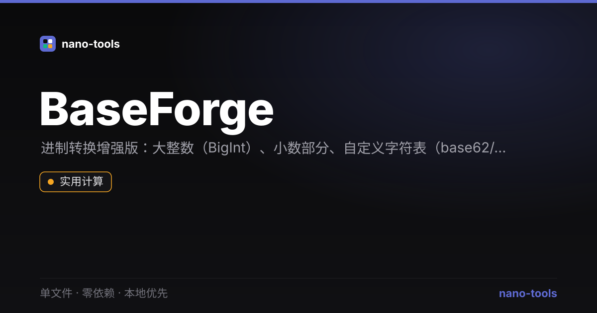

  

# BaseForge · 进制转换增强版

任意进制互转，支持**大整数（BigInt 精度）**、**小数部分**、**自定义字符表**（base62 / base58 等）。单文件、零依赖、100% 本地运行。

## 特性

- **2–36 进制**：二/八/十/十六进制一屏对照，一键复制
- **大整数**：BigInt 精度，`ffffffffffffffff` ↔ `18446744073709551615` 不失真
- **小数支持**：`255.5` → `ff.8`、`0.5` → `0.1`(二进制)
- **自定义字符表**：填入任意符号集（如 base62、base58），进制 = 字符表长度
- **负数**：保留符号转换

## 使用

打开 [在线 Demo](https://wangzifan396-wzf.github.io/WB/tools/BaseForge/) 或直接双击 `index.html`。

## 技术

- 纯函数 `parseNum / formatNum / convert / digitVal` 可独立测试
- 整数用 `BigInt`，小数用浮点逐位累加/展开
- 系统字体栈、零外部请求、离线可用
- 测试：`node _test.js`（纯函数）与 `JSDOM=1 node _test.js`（功能）

## 更多 nano-tools

这是 [nano-tools](https://github.com/wangzifan396-wzf) 开源开发者工具矩阵的一员 —— 一系列单文件、零依赖、本地优先的小工具。

## License

MIT
