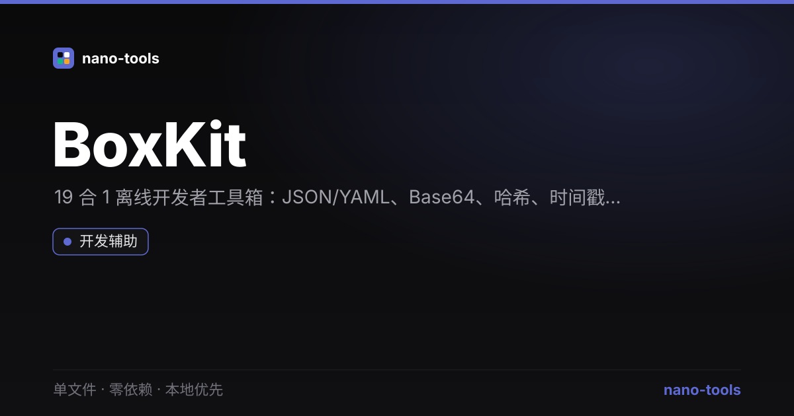

<p align="center">
  <a href="https://wangzifan396-wzf.github.io/WB/tools/BoxKit/"></a>
  
  
  
  
  
  
  
</p>

<p align="center">
  <a href="https://wangzifan396-wzf.github.io/WB/tools/BoxKit/"><strong>🌐 在线试用 Live Demo</strong></a>
</p>
<p align="center"></p>

---

# BoxKit · 离线开发者工具箱

> 单文件、零依赖、本地优先的开发者工具箱。打开 `index.html` 即用，所有计算都在你的浏览器里完成，**文件与文本绝不上传**。

  

对标 [it-tools](https://github.com/CorentinTh/it-tools) 的**轻量离线版**：不需要安装、不需要后端、不需要联网，一个 HTML 文件就是整套工具。

---

## ✨ 特性

- **零依赖 / 单文件**：整个应用就是一个 `index.html`，没有任何外部请求、没有构建步骤。
- **本地优先**：解析、哈希、转换全在浏览器本地完成，数据不出本机，天然合规。
- **即开即用**：双击 `index.html` 即可使用，也可一键部署到任意静态托管（GitHub Pages / CloudStudio 等）。
- **美观顺滑**：Linear 暗色工程风，暗 / 亮主题切换，动效只使用 `transform` / `opacity`，不卡顿。
- **实时计算**：输入即出结果，支持工具内搜索过滤。

## 🧰 内置工具（19+）

| 分类 | 工具 | 说明 |
| --- | --- | --- |
| 编码 | JSON 工具 | 格式化 / 压缩 / 校验 |
| 编码 | Base64 | Base64 编 / 解码（UTF-8 安全） |
| 编码 | URL 编解码 | URI 组件编 / 解码 |
| 编码 | JWT 解码 | 解析 JWT 的 header / payload（不验证签名） |
| 生成 | UUID / ID | 生成 UUID v4 或短随机 ID |
| 生成 | 哈希 | SHA-1 / 256 / 384 / 512（Web Crypto） |
| 生成 | Lorem 生成 | 占位文本（段落 / 句子 / 单词） |
| 转换 | 时间戳转换 | Unix 时间戳 <-> 日期 |
| 转换 | 进制转换 | 2 / 8 / 10 / 16 进制互转 |
| 转换 | YAML ⇄ JSON | YAML 与 JSON 互转 |
| 转换 | SQL 格式化 | 关键字大写 + 子句换行 |
| 转换 | Cron 解释 | 把 cron 表达式翻译成人话 |
| 文本 | 正则测试 | 实时高亮匹配 |
| 文本 | 命名风格 | camel / snake / kebab 等互转 |
| 文本 | 文本统计 | 字符 / 词 / 行 / 字节 |
| 文本 | Slugify | 标题转 URL 友好 slug |
| 文本 | 文本 Diff | 逐行对比两段文本 |
| 转换 | 颜色转换 | HEX / RGB / HSL 互转 |
| 转换 | Cron 解释 | 把 cron 表达式翻译成人话 |
| 文本 | 正则测试 | 实时高亮匹配 |
| 文本 | 命名风格 | camel / snake / kebab / Pascal / CONSTANT / Title 互转 |
| 文本 | 文本统计 | 字符 / 词 / 行 / UTF-8 字节 |
| 文本 | 文本 Diff | 逐行对比两段文本（LCS） |
| 生成 | 密码生成 | 可配置长度与字符集的强度密码 |

## 🚀 使用

1. 下载 `index.html`；
2. 直接用浏览器打开（推荐 Chrome / Edge / Firefox）；
3. 左侧选择工具，输入即出结果，点击「复制结果」即可。

> 提示：哈希功能依赖浏览器 `Web Crypto`（现代浏览器与 `file://` 均支持）。

## 🧪 测试

纯逻辑层带有单元测试，无需任何依赖：

```bash
node _test.js
```

## 🛠 技术说明

- 纯原生 HTML / CSS / JavaScript，单文件自包含。
- 工具核心逻辑为纯函数，与 UI 解耦，便于测试与复用。
- 哈希使用浏览器内置 `crypto.subtle`；UUID / 密码使用 `crypto.getRandomValues`，均为密码学安全随机源。

## 📄 许可证

MIT —— 随便用、随便改、欢迎提 PR。
