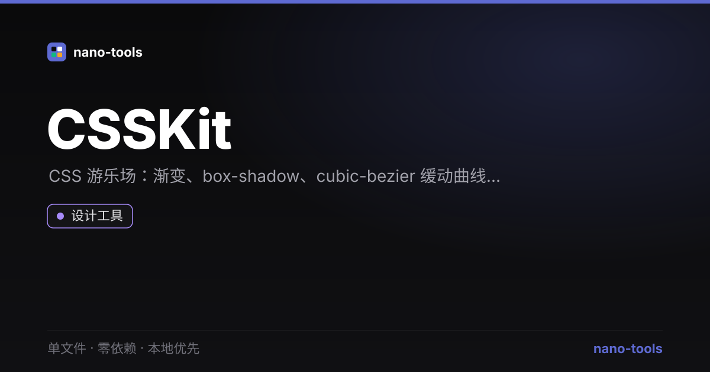

<p align="center">  
</p>
# CSSKit

> 离线优先的 CSS 游乐场 —— 渐变 / box-shadow / cubic-bezier / Flex 四合一，实时预览、一键复制。

[](https://github.com/wangzifan396-wzf/WB/tree/main/tools/CSSKit/stargazers)
[](https://github.com/wangzifan396-wzf/WB/tree/main/tools/CSSKit/network/members)
[](https://github.com/wangzifan396-wzf/WB/tree/main/tools/CSSKit/issues)
[](https://github.com/wangzifan396-wzf/WB/tree/main/tools/CSSKit/commits/main)
[](https://github.com/wangzifan396-wzf/WB/tree/main/tools/CSSKit)
[](LICENSE)

🌐 **在线试用：** https://wangzifan396-wzf.github.io/WB/tools/CSSKit/

## 特性
- **零依赖、单文件**：只有 `index.html`，双击即用。
- **渐变生成器**：线性 / 径向，任意角度、多色标增删。
- **box-shadow**：X/Y/模糊/扩散/不透明度/inset 全可调。
- **cubic-bezier 缓动**：Canvas 曲线可视化 + 实时动画预览。
- **Flex 布局**：direction / justify / align / wrap / gap 实时演示。
- **实时 CSS 输出**，一键复制。**明暗主题**。

## 使用
顶部切换四个工具，左侧拖动参数，右侧实时预览，底部复制生成的 CSS。

## 技术栈
纯 HTML + CSS + 原生 JS（Canvas 绘制贝塞尔曲线），无任何第三方库。

## 测试
```bash
node _test.js   # 纯函数单测（gradient/shadow/bezier/flex）+ jsdom 功能测试
```

## License
[MIT](LICENSE)
