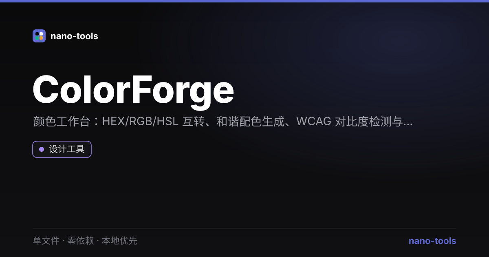

<p align="center">  
</p>
# ColorForge

调色板生成 + WCAG 对比度校验。单文件、零依赖、本地优先 —— 双击 `index.html` 即用，数据永不离机。

## 功能
- **格式互转**：HEX / RGB / HSL 实时互转
- **和谐配色**：互补色、类似色、三角色、单色阶（基于基础色一键生成）
- **WCAG 对比度**：双色对比度计算，标注 AA / AAA 在「正常 / 大号」文本下的通过情况
- **实时预览**：正常 / 大号文本的对比效果
- 随机取色、一键复制任意色值

## 设计原则
遵循 nano-tools 统一设计系统：Linear 冷峻暗色、零外部请求、隐私优先。

## 测试
```bash
node _test.js            # 纯函数单测
JSDOM=1 node _test.js    # + jsdom 功能测试
```

## 许可
MIT © wangzifan396-wzf
