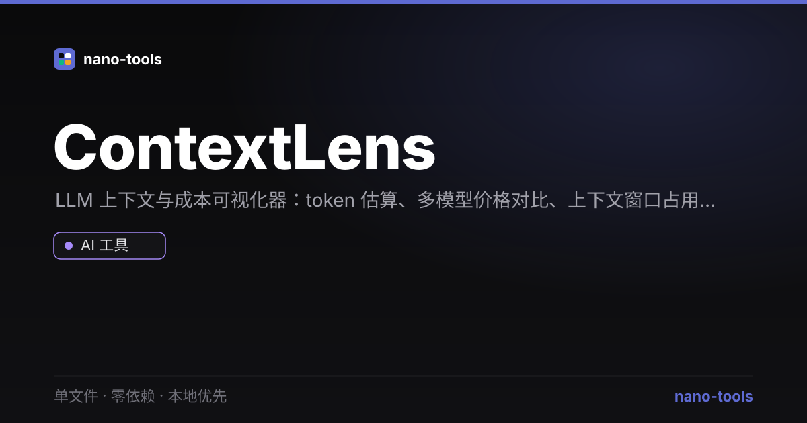

  
  
  
  
  
  
  
  

  <a href="https://wangzifan396-wzf.github.io/WB/tools/ContextLens/"><strong>🌐 在线试用 Live Demo</strong></a>

---

# ContextLens

> 单文件 · 零依赖 · 本地优先的 LLM 上下文与成本可视化器

把你的代码库或文本拖进来，瞬间看清 **token 占比、上下文窗口占用，以及在不同模型上的花费**。所有计算都在浏览器本地完成，**文件不上传、不依赖任何后端**。

  

---

## 为什么做这个

给 Claude Code / Cursor / Copilot 喂代码时，人人都踩过这些坑：

- 「这段 prompt 到底多少 token？」
- 「上下文窗口会不会爆？」
- 「跑一次要花多少钱？换个模型能省多少？」

[Repomix](https://github.com/yamadashy/repomix) 用 22k⭐ 证明了需求——它把代码库打包成 LLM 就绪的上下文。ContextLens 借鉴这个思路，但重做成 **打开即用、零安装、强可视化** 的单文件版本：不用装 Node、不用跑命令，拖个文件夹进来就有图表。

## 功能

- 📁 **拖文件夹即解析**：自动跳过 `node_modules`、`.git`、二进制与超大文件，并支持读取项目里的 `.gitignore`
- 📊 **token 占比可视化**：逐文件 token 条形图，一眼看出谁最占上下文
- 🎯 **上下文窗口仪表盘**：所选模型的窗口占用百分比，超窗高亮告警
- 💰 **多模型成本对比**：内置 18+ 主流模型（GPT / Claude / Gemini / DeepSeek / Qwen / Llama…），按当前 token 量实时算输入成本并排序
- 📦 **一键导出上下文包**：Markdown / XML / JSON 三种格式，直接粘贴进你的 Agent
- 🌙 **明暗主题**：偏好存于 `localStorage`
- ⚡ **流畅不卡**：动效仅用 `transform`/`opacity`，长文件列表限量渲染，纯前端运行

## 用法

就这么简单：

1. 下载 `index.html`
2. 用浏览器打开（双击即可，无需服务器）
3. 拖入项目文件夹，或切到「粘贴文本」粘贴内容
4. 看图表、选模型、导出上下文包

> 直接部署到 GitHub Pages / Netlify / 任意静态托管也行——它就是一个静态文件。

## 技术说明

- **零依赖、单文件**：HTML + CSS + 原生 JS 全部内联，运行时无任何外部请求
- **本地优先**：基于浏览器 File API 解析，数据不出本机；可选 `localStorage` 存主题
- **token 估算为启发式**：中文 / 英文 / 代码分别加权（中文约 1.5–2 字符/token，英文约 4 字符/token，代码约 3.5）。这是**估算值**，用于相对比较；精确计数需内联分词表，留作后续增强
- **模型价格为 2026 年近似值**：仅供参考，请以各家官方为准；价格表在源码 `MODELS` 数组中，易扩展

## 路线图

- [ ] 内联小型分词表，提供「精确模式」（GPT/Claude 等）
- [ ] 可缩放的交互式文件关系图（力导向）
- [ ] 自定义模型价格表（UI 编辑 + 导入/导出）
- [ ] 上下文预算预警与自动精简建议

## 开源协议

MIT —— 随便用、随便改、随便再发布。

---

*ContextLens 是一个独立的开源小工具，与任何商业产品无隶属关系。*
