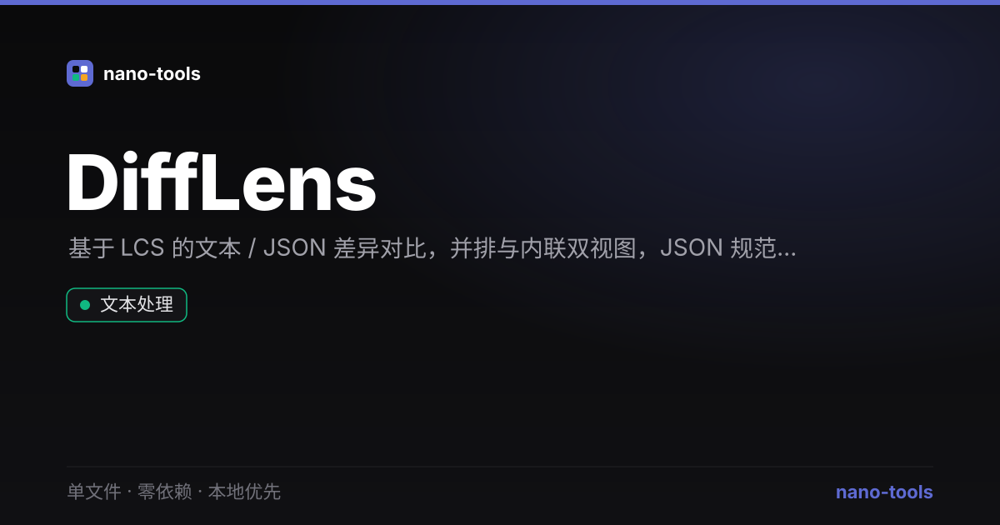

<p align="center">
  <a href="https://wangzifan396-wzf.github.io/WB/tools/DiffLens/"></a>
  
  
  
  
  
  
  
</p>

<p align="center">
  <a href="https://wangzifan396-wzf.github.io/WB/tools/DiffLens/"><strong>🌐 在线试用 Live Demo</strong></a>
</p>
<p align="center"></p>

---

# DiffLens · 文本 / JSON 差异对比

基于 LCS 最长公共子序列的逐行差异对比工具。单文件、零依赖、纯本地运行，粘贴即比，内容不上传。

## ✨ 功能

- **LCS 逐行 diff** — 精确定位新增 / 删除 / 未变行，而非简单逐行对齐
- **并排 & 内联** 两种视图一键切换，带行号与增删配色（绿增红删）
- **JSON 模式** — 先规范化（可选按键递归排序）再对比，忽略键顺序差异，只看真正的结构改动
- **对比选项** — 忽略大小写、忽略首尾空白
- **一键交换** A/B，实时统计 `+新增 / -删除 / =未变`
- **暗 / 亮主题**，偏好本地记忆

## 🚀 使用

直接下载 `index.html` 双击打开，或访问 [在线 Demo](https://wangzifan396-wzf.github.io/WB/tools/DiffLens/)。

## 🧪 测试

diff 算法、JSON 规范化、统计均为纯函数，可离线单测：

```bash
node _test.js
```

## 🛠 技术

LCS 动态规划 diff + Vanilla JS，无构建、无依赖。

## 📄 License

MIT
