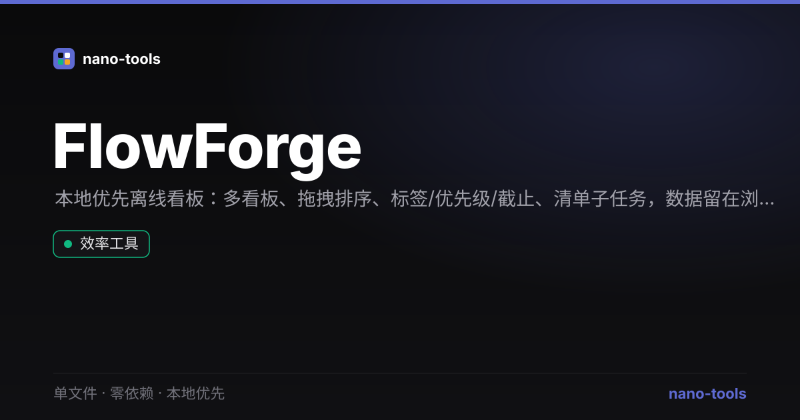

<p align="center"><br>
  
  
  
  
</p>

# FlowForge

本地优先的离线任务看板（Kanban）。单文件、零依赖、隐私优先 —— 双击 `index.html` 即用，所有数据都留在你自己的浏览器里，从不上传。

## 功能
- **多看板**：一处管理工作 / 生活 / 项目等多个看板，一键切换
- **拖拽排序**：卡片跨列拖拽、列之间拖拽重排（原生 HTML5 拖放）
- **任务细节**：标题、描述、优先级（高/中/低）、截止日期、标签、清单子任务
- **截止提醒**：逾期 / 即将到期 / 未来 三态标色
- **搜索与筛选**：按关键词、优先级实时过滤
- **看板统计**：总数、已完成、逾期、高优先级一览
- **导入 / 导出**：整个看板导出为 JSON，随时备份或迁移
- **中英双语** + **深色 / 浅色主题**，右下角一键切换
- **PWA**：可安装到桌面，离线可用

## 设计原则
遵循 nano-tools 统一设计系统：Linear 冷峻暗色、零外部请求、隐私优先。数据保存在 `localStorage`，无账号、无后端、无追踪。

## 使用
直接打开 `index.html` 即可。也可访问在线 demo：<https://wangzifan396-wzf.github.io/WB/tools/FlowForge/>

## 测试
```bash
node _test.js                          # 纯函数单测（看板数据逻辑）
npm install jsdom --no-save && node smoke.js   # jsdom 冒烟（UI 渲染 + 交互）
```

## 许可
MIT © wangzifan396-wzf

---
<p align="center"><sub>更多单文件工具 → <a href="https://wangzifan396-wzf.github.io/WB/">nano-tools</a></sub></p>
