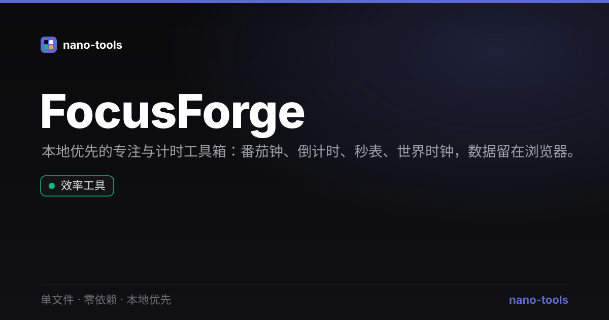

<p align="center">
  
</p>

<h1 align="center">FocusForge</h1>

<p align="center">
  <b>本地优先的专注与计时工具箱</b> —— 番茄钟 · 倒计时 · 秒表 · 世界时钟
</p>

<p align="center">
  
  
  
  
  
</p>

<p align="center">
  <a href="https://wangzifan396-wzf.github.io/WB/tools/FocusForge/">🌐 在线试用</a> ·
  <a href="https://github.com/wangzifan396-wzf/WB/tree/main/tools/FocusForge">源代码</a> ·
  <a href="https://wangzifan396-wzf.github.io/WB/">nano-tools 全部工具</a>
</p>

---

## 功能

- **🍅 番茄钟**：可配置专注 / 短休息 / 长休息时长，每 N 个专注后自动长休息，自动进入下一阶段；实时圆环进度 + 完成计数（今日 / 累计）。
- **⏳ 倒计时**：多组独立倒计时，名称 + 时长（支持 `MM:SS` 或纯分钟），开始 / 暂停 / 重置，归零高亮提醒。
- **⏱ 秒表**：开始 / 暂停 / 重置 + 计圈（Lap），毫秒级显示。
- **🌍 世界时钟**：基于浏览器内置 `Intl` 时区数据，添加任意 IANA 时区城市，实时显示当地时间与偏移；内置北京 / UTC / 纽约 / 伦敦 / 东京。
- **本地优先**：所有数据（番茄设置、计时器、城市、秒表计圈）仅存于你的浏览器 `localStorage`，**零上传、零追踪**。
- **单文件 / 零依赖**：一个 `index.html` 即可运行，离线可用，可“添加到主屏幕”当作 App（PWA）。
- **中英双语**：一键切换界面语言。
- **Linear 暗色设计**：统一视觉语言，深 / 浅主题。

## 设计原则

- **单文件交付**：不依赖任何 CDN、框架或外部请求。
- **本地优先**：数据永远留在你自己的设备上。
- **零依赖**：纯原生 HTML / CSS / JavaScript。

## 测试

```bash
node _test.js     # 纯函数单元测试
NODE_PATH=node_modules node smoke.js   # jsdom 真机冒烟测试（需 npm i jsdom）
```

纯函数（计时 / 阶段推进 / 导入导出 / 时区格式化等）经 `module.exports` 暴露，可在 Node 下独立验证；GitHub Actions 每次 push 自动跑测试。

## 开源协议

[MIT](LICENSE) © 2026 wangzifan396-wzf · 属于 [nano-tools](https://wangzifan396-wzf.github.io/WB/) 开源开发者工具矩阵。
