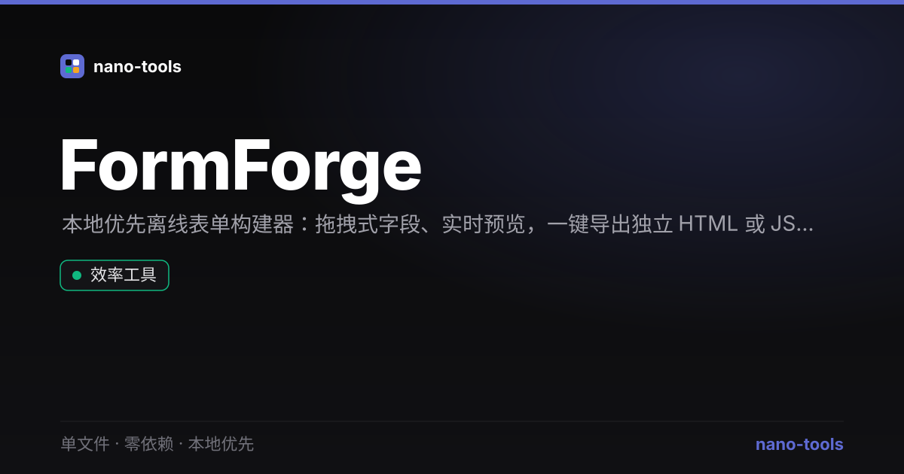

# FormForge

本地优先的离线**表单构建器** —— 拖拽式添加字段、实时预览、一键导出独立 HTML 或 JSON Schema。**单文件、零依赖、纯前端**，数据留在你自己的浏览器。

[](https://github.com/wangzifan396-wzf/WB/tree/main/tools/FormForge/actions/workflows/test.yml)




## ✨ 功能

- **13 种字段类型**：单行文本、多行文本、邮箱、数字、电话、密码、网址、日期、下拉选择、单选、多选、滑块、颜色
- **可视化构建**：添加 / 编辑 / 删除 / 上下移动字段，无需写代码
- **实时预览**：右侧即时渲染真实可用的表单
- **导出独立 HTML**：生成自带样式的完整 `.html` 文件，可直接部署
- **导出 / 导入 JSON Schema**：表单定义可序列化、可版本管理
- **多表单管理**：同一页面维护多个表单，互不影响
- **表单校验提示**：重复 name、非法字段名、缺少选项等问题实时标红
- **本地优先**：所有数据存于浏览器 `localStorage`，不上传任何服务器
- **中英双语**：界面随浏览器语言或右下角按钮切换

## 🎨 设计

遵循 nano-tools 锁定的 **Linear 冷峻暗色**设计系统：

- 画布 `#0A0A0B` / 卡片 `#141417` / 强调色 `#5E6AD2`
- 系统字体栈、零外部请求、离线可用（PWA + service worker 缓存同源静态）
- 仅 `transform` / `opacity` 动效，尊重 `prefers-reduced-motion`

## 🧪 测试

纯函数单测 + jsdom 端到端冒烟，CI 实跑：

```bash
node _test.js     # 纯函数断言（fieldCatalog / addField / renderFieldHtml / validateForm ...）
npm install jsdom --no-save && node smoke.js   # jsdom 加载整页，断言零运行时错误 + 核心交互
```

## 🔗 更多

FormForge 是 [nano-tools](https://wangzifan396-wzf.github.io/WB/) 单文件零依赖工具集的一员。返回门户发现全部工具。
