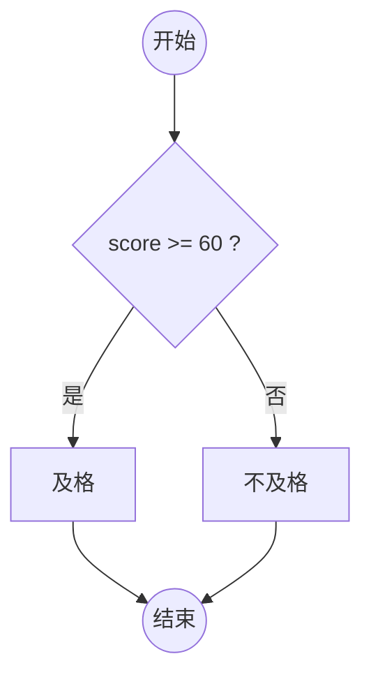

# GraphForge · 离线图表编辑器

> 单文件、零依赖、本地优先的 **Mermaid 图表编辑器**：写 DSL → 实时预览 → 一键导出 SVG / PNG。
> 属于 [nano-tools](https://github.com/wangzifan396-wzf) 单文件开发者工具矩阵。

[](#在线试用)
[](#)
[](#)

## ✨ 特性

- 🧩 **单文件**：整个应用就是一个 `index.html`，双击即开，无需安装、无需服务器
- 🚫 **零依赖 / 离线**：Mermaid 引擎已内联，运行时**不发任何网络请求**，数据永不离机
- 🔄 **实时渲染**：输入 Mermaid 语法，防抖自动预览
- 📤 **导出**：一键导出 **SVG**（矢量）与 **PNG**（2× 高清）
- 🌐 **中英双语**：界面一键切换，偏好记忆
- 🧰 **内置示例**：流程图 / 时序图 / 类图 / 状态图，开箱即用
- 🎨 **暗色主题**：Linear 风格，护眼一致

## 🖥 在线试用

打开 `index.html` 即可。也可访问 GitHub Pages 在线 Demo（仓库启用后自动生成）。

## 🚀 用法

1. 左侧输入 Mermaid 代码，例如：



2. 右侧实时显示图表
3. 点「导出 SVG / PNG」保存到本地

支持 `graph` / `flowchart` / `sequenceDiagram` / `classDiagram` / `stateDiagram` 等 Mermaid 语法。

## 🛠 开发

源码在 `template.html`（应用代码）+ `mermaid.lib.js`（Mermaid UMD 包），由 `build.py` 内联生成单文件 `index.html`：

```bash
python build.py   # 产出 index.html（已内联 Mermaid，可独立分发）
```

> 发布时只需 `index.html` 一个文件。

## ✅ 测试

```bash
node _test.js     # 纯函数单测（转义 / 文件名 / 语法校验 / 示例合法性）
```

## 📄 许可证

MIT © nano-tools
