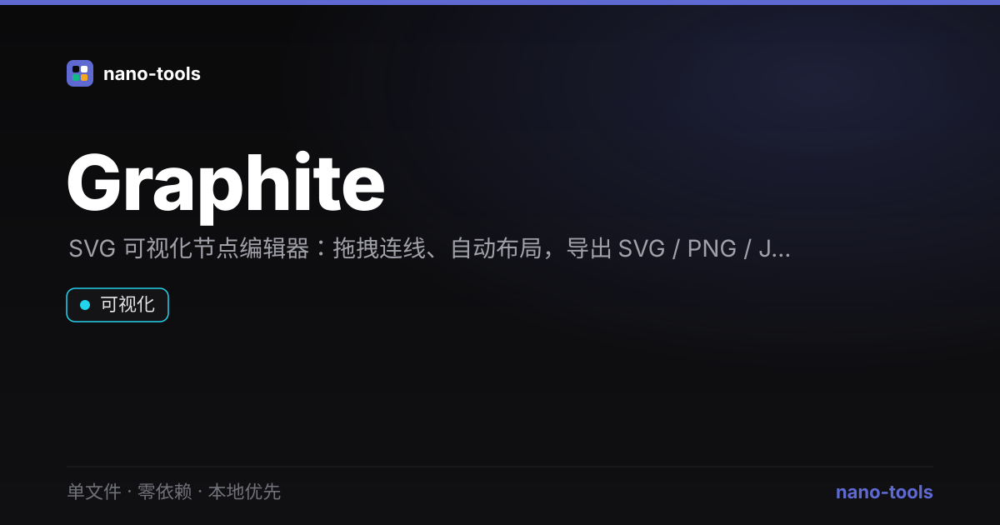

  
  
  
  
  
  
  
  

  <a href="https://wangzifan396-wzf.github.io/WB/tools/Graphite/"><strong>🌐 在线试用 Live Demo</strong></a>

---

# Graphite

> 单文件 · 零依赖 · 本地优先的 **可视化节点编辑器**（思维导图 / 流程图 / 关系图）

一个 HTML 文件，打开即用：拖拽节点、连线、自动布局、导出矢量图与数据。
**数据只存在你的浏览器本地，不上传任何服务器。**

---

## ✨ 特性

- **零依赖、单文件**：下载 `index.html` 双击即可用，无需安装、无需构建、无需联网。
- **本地优先 / 隐私**：所有内容只存浏览器 `localStorage`，刷新不丢，文件从不出本机。
- **可视化编辑**：
  - 拖拽移动节点、滚轮缩放、空白处拖动平移
  - 从节点底部端口拖到另一节点即可连线
  - 双击节点就地编辑文字、可换配色
  - 一键 **自动分层布局**（思维导图 / 树状结构自动排布）
- **多格式导出**：
  - `SVG`（矢量，可继续在 Figma / Illustrator 编辑）
  - `PNG`（位图，2× 高清，适合贴文档 / PPT）
  - `JSON`（完整数据，可再导入 / 程序处理）
  - `Markdown`（自动把图转成大纲列表）
- **暗 / 亮双主题**，毛玻璃导航、GPU 动效（仅 `transform`/`opacity`），流畅不卡。
- **示例一键加载**，首次打开即有思维导图示范。

## 🚀 用法

1. 下载 `index.html`（或克隆本仓库后打开）。
2. 直接双击在浏览器打开即可使用。
3. 操作速查：
   | 操作 | 效果 |
   | --- | --- |
   | 拖节点 | 移动 |
   | 拖节点底部小圆点 → 另一节点 | 连一条线 |
   | 双击节点 | 编辑文字 |
   | 滚轮 | 以光标为中心缩放 |
   | 拖空白处 | 平移画布 |
   | 选中节点/连线后按 `Delete` | 删除 |
   | 顶部按钮 | 新建 / 自动布局 / 适应视图 / 示例 / 清空 / 导出 / 主题 |

## 🧩 适用场景

- 梳理思路、做**思维导图**（本地、私密、不依赖任何 SaaS）
- 画**流程图 / 架构图 / 关系图**，导出 PNG 贴进文档或 PPT
- 把已有的笔记 / 大纲 **导出为 Markdown 大纲**
- 作为**离线白板**，临时快速构图

## 🔒 隐私说明

Graphite 完全运行在浏览器内，**没有任何网络请求、不上传任何数据**。你的图只保存在本机浏览器。
（PNG 导出在浏览器内通过 `<canvas>` 完成，数据同样不出本机。）

## 🛠 技术细节

- 纯原生 JavaScript + SVG，**零第三方库**，单文件自包含。
- 自动布局：基于有向边的 BFS 分层算法（最短路径深度），同层水平铺开、垂直分层，支持环与孤立节点。
- 图转 Markdown：由有向边构造树，生成嵌套列表大纲（环 / 多父降级平铺）。
- 导出 SVG 内联背景与样式，保证在其他软件中观感一致。

## 📄 许可

MIT —— 随便用、随便改、拿来当自己项目的一部分都行。

---

*Graphite 是「单文件 / 本地优先」工具系列的一员。同类项目：Inkwell（本地知识库）、BoxKit（开发者工具箱）、ContextLens（LLM 上下文与成本可视化）。*
