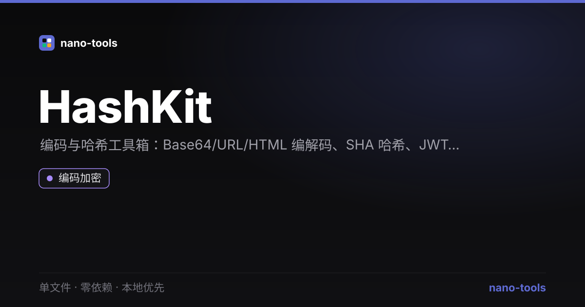

<p align="center">
  <a href="https://wangzifan396-wzf.github.io/WB/tools/HashKit/"></a>
  
  
  
  
  
  
  
</p>

<p align="center">
  <a href="https://wangzifan396-wzf.github.io/WB/tools/HashKit/"><strong>🌐 在线试用 Live Demo</strong></a>
</p>
<p align="center"></p>

---

# HashKit · 编码 / 哈希 / JWT 工具箱

一个 **单文件、零依赖、本地优先** 的编码与哈希工具箱。所有运算在浏览器本地完成，数据永远不离开你的设备。

## ✨ 功能

- **编 / 解码**：Base64（支持 Unicode）、URL、HTML 实体，编码 / 解码双向即时切换
- **哈希**：纯 JS 实现的 **SHA-256**（无需联网、无需 `crypto.subtle`）+ FNV-1a 32 位快速指纹
- **JWT 解码**：本地解析 Header 与 Payload，自动识别 `exp` 过期时间
- **生成器**：UUID v4、可配置随机密码（长度 / 大小写 / 数字 / 符号）+ 强度评估

## 🚀 使用

下载 `index.html`，双击用浏览器打开即可——无需安装、无需构建、无需联网。

## 🧪 测试

```bash
node _test.js
```

纯函数核心（SHA-256 已用官方测试向量校验）全部覆盖单元测试。

## 🛠 技术

单文件 HTML + 原生 JavaScript，零第三方依赖。深色 / 浅色主题，偏好存于 `localStorage`。

## 📄 License

MIT
