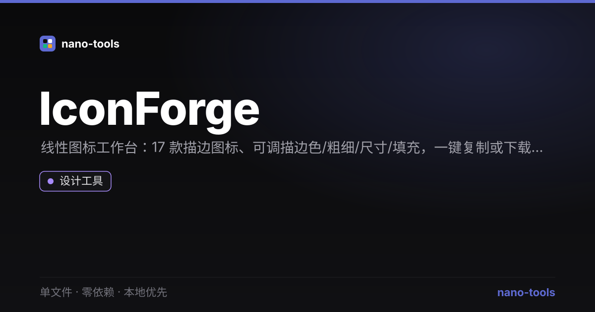

<p align="center">  
</p>
# IconForge

SVG 线性图标编辑器。单文件、零依赖、本地优先。

## 功能
- **内置图标库**：17 个常用线性图标（home / user / search / heart / star / 编辑 / 下载 …）
- **实时编辑**：描边颜色、描边宽度、输出尺寸，一键切换「填充 / 描边」模式
- **导出**：复制 SVG 源码 / 下载 `.svg` 文件

## 设计原则
遵循 nano-tools 统一设计系统：Linear 冷峻暗色、零外部请求、隐私优先。

## 测试
```bash
node _test.js
JSDOM=1 node _test.js   # + 功能测试
```

## 许可
MIT © wangzifan396-wzf
