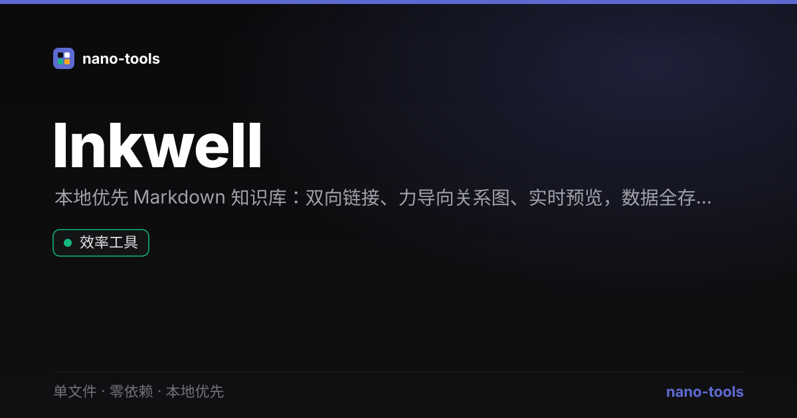

  
  
  
  
  
  
  
  

  <a href="https://wangzifan396-wzf.github.io/WB/tools/Inkwell/"><strong>🌐 在线试用 Live Demo</strong></a>

---

# ✒ Inkwell · 本地优先知识库

> 一个**单文件、零依赖、本地优先**的 Markdown 个人知识库 —— 把 Obsidian 的「双向链接 + 知识图谱」装进一个 HTML 文件里。打开即用，数据只存在你自己的浏览器。

[English](#english) · [中文说明](#中文说明)

---

## ✨ 特性

- 🗂 **多笔记管理**：侧边栏列表、全文搜索、按更新时间排序
- ⚡ **实时预览**：左边写 Markdown，右边即时渲染
- 🔗 **双向链接**：用 `[[笔记标题]]` 在笔记间建立连接，点击即可跳转
- 🕸 **知识图谱**：根据双向链接自动生成力导向图（Canvas 绘制），一眼看清知识网络
- 📥 **导入 / 导出**：支持批量导入 `.md` / `.json`，导出全部笔记或单篇
- 🌗 **明暗主题**：本地保存偏好
- 🔒 **真正本地优先**：所有数据存于浏览器 `localStorage`，**不上传任何服务器**

## 🚀 使用

直接双击 `index.html` 用浏览器打开即可，无需安装、无需联网、无需后端。

首次打开会有 3 篇示例笔记（含双向链接），方便你立刻看到图谱效果。

### 支持的 Markdown 语法

标题、粗体 / 斜体、行内代码与代码块、有序 / 无序列表、引用、分割线、表格、外链，以及 `[[双向链接]]`。

## 🧩 适合谁

- 想要轻量、私密、可离线笔记工具的人
- 喜欢「卡片盒 / 双向链接」式知识管理，又不想装重型客户端的人
- 想找一个**单文件**、可随手拷走、可放进 U 盘的知识库的人

## 🛠 技术说明

- 纯原生 HTML / CSS / JavaScript，单文件，零外部依赖、零构建步骤
- 存储：浏览器 `localStorage`（约 5MB，适合纯文本笔记）
- Markdown 解析、力导向布局均为**自实现**，无第三方库
- 已通过 `node` 单元自测（21 项）与 `jsdom` 端到端功能自测（13 项）

## 📄 许可

MIT —— 随便用、随便改。

---

## English

**Inkwell** is a single-file, zero-dependency, local-first Markdown knowledge base — a mini Obsidian packed into one HTML file. Your notes live only in your browser.

- Multi-note management with full-text search
- Live Markdown preview
- `[[WikiLinks]]` with one-click navigation
- Auto-generated force-directed knowledge graph (Canvas)
- Import / export `.md` & `.json`
- Light / dark theme, all data stored locally

Just open `index.html`. No install, no server, no network.

MIT Licensed.
