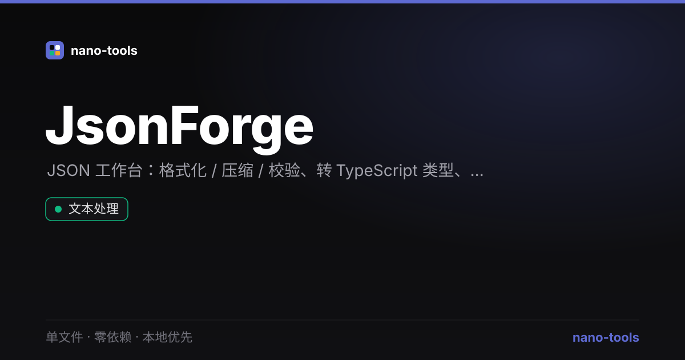

<p align="center">
  <a href="https://wangzifan396-wzf.github.io/WB/tools/JsonForge/"></a>
  
  
  
  
  
  
  
</p>

<p align="center">
  <a href="https://wangzifan396-wzf.github.io/WB/tools/JsonForge/"><strong>🌐 在线试用 Live Demo</strong></a>
</p>
<p align="center"></p>

---

# JsonForge · JSON 工作台

一个 **单文件、零依赖、本地优先** 的 JSON 全能工作台。格式化、转类型、查询、树形浏览一站搞定，数据全在本地处理。

## ✨ 功能

- **格式化 / 压缩 / 校验**：实时语法高亮，错误精确定位
- **排序键**：递归按字母排序对象所有键，diff 更友好
- **转 TypeScript 类型**：自动推断嵌套结构，生成 `interface` / `type` 定义
- **JSONPath 查询**：支持 `$.a.b`、`[0]`、`[-1]`、`[*]`、`["key"]` 等语法
- **多视图输出**：JSON（高亮）/ TypeScript / 树形三种模式
- **实时统计**：键数、对象 / 数组 / 各类型值数量、最大嵌套深度

## 🚀 使用

下载 `index.html`，双击用浏览器打开即可——无需安装、无需构建、无需联网。

## 🧪 测试

```bash
node _test.js
```

格式化、排序、类型推断、JSONPath 查询等核心纯函数均有单元测试覆盖。

## 🛠 技术

单文件 HTML + 原生 JavaScript，零第三方依赖。深色 / 浅色主题，偏好存于 `localStorage`。

## 📄 License

MIT
