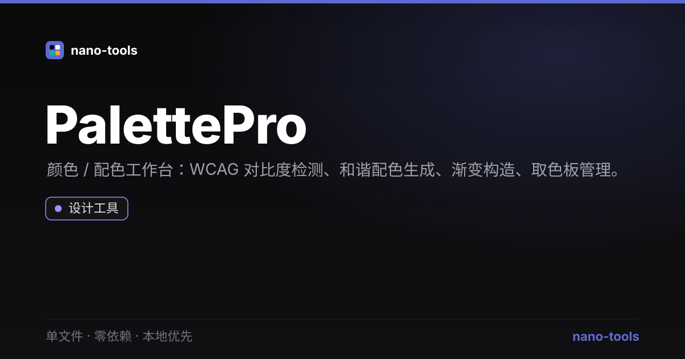

  
  
  
  
  
  
  
  

  <a href="https://wangzifan396-wzf.github.io/WB/tools/PalettePro/"><strong>🌐 在线试用 Live Demo</strong></a>

---

# PalettePro · 颜色工具套件

单文件、零依赖、本地优先的**颜色工具套件**：WCAG 对比度检查、配色和谐生成、从图片提取调色板。打开即用，数据不上传。

## ✨ 功能
- **WCAG 对比度检查**：输入前景/背景色，实时给出对比度比率，并标注正文/大字号 AA、AAA 是否通过
- **配色和谐**：基于基准色生成互补色、类似色、三角色、分裂互补、四角色，点击复制
- **从图片提取调色板**：上传图片，浏览器内采样像素并量化出主色（Canvas，不上传）
- **暗 / 亮主题**

## 🚀 使用
直接双击 `index.html`。

## 🧩 技术说明
- 纯原生 HTML / CSS / JS，**零第三方依赖**，单文件自包含
- 对比度与配色为精确算法：相对亮度（sRGB）、WCAG 对比度公式、HSL 色相旋转
- 核心为纯函数（`hexToRgb` / `contrastRatio` / `rgbToHsl` / `hslToRgb` / `harmonies`），可在 Node 下单测（`node _test.js`，20 项断言）
- 取色板基于 `Canvas.getImageData` 像素量化，纯本地运行

## 📄 许可
MIT
