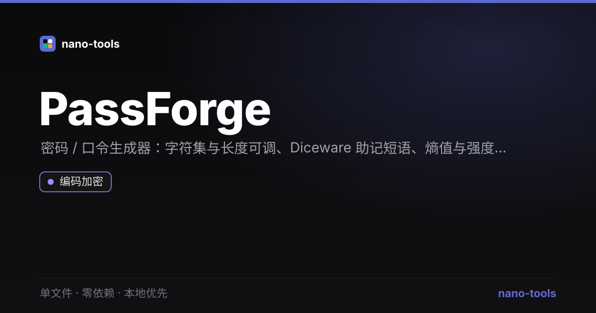

<p align="center">  
</p>
# PassForge

密码 / 口令生成器 + 强度评估。单文件、零依赖、本地优先 —— 双击 `index.html` 即用。

## 功能
- **密码生成**：可调长度（4–64），自定义字符集（大写 / 小写 / 数字 / 符号 / 排除易混字符）
- **强度评估**：基于熵（bits）的评级（弱 / 中 / 强 / 很强 / 极强）+ 常见弱模式检测
- **密码短语**：内置词表生成易记且高熵的口令（如 `river-comet-ember-velvet`）
- 一键复制、实时反馈

## 设计原则
遵循 nano-tools 统一设计系统：Linear 冷峻暗色、零外部请求、隐私优先（全程本地计算，不联网）。

## 测试
```bash
node _test.js
JSDOM=1 node _test.js   # + 功能测试
```

## 许可
MIT © wangzifan396-wzf
