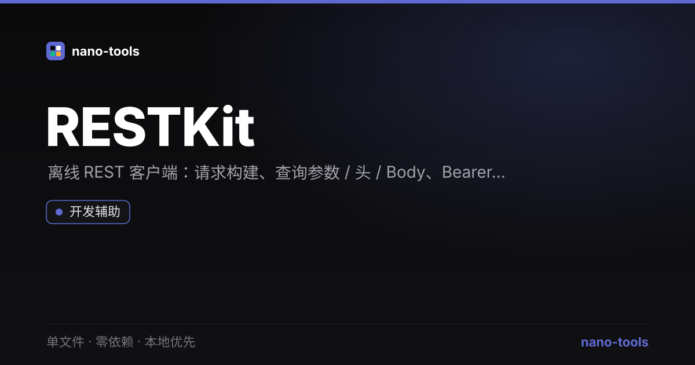

<p align="center">  
</p>
# RESTKit

> 离线优先的轻量 REST / HTTP 客户端 —— 双击即用的 Postman / Hoppscotch 开源替代品。

[](https://github.com/wangzifan396-wzf/WB/tree/main/tools/RESTKit/stargazers)
[](https://github.com/wangzifan396-wzf/WB/tree/main/tools/RESTKit/network/members)
[](https://github.com/wangzifan396-wzf/WB/tree/main/tools/RESTKit/issues)
[](https://github.com/wangzifan396-wzf/WB/tree/main/tools/RESTKit/commits/main)
[](https://github.com/wangzifan396-wzf/WB/tree/main/tools/RESTKit)
[](LICENSE)

🌐 **在线试用：** https://wangzifan396-wzf.github.io/WB/tools/RESTKit/

## 特性
- **零依赖、单文件**：只有一个 `index.html`，下载即用，无需安装、无需构建。
- **本地优先**：所有请求与历史记录都在你的浏览器内完成，数据不上传任何服务器。
- **完整请求构建**：Method（GET/POST/PUT/PATCH/DELETE/HEAD/OPTIONS）、URL、查询参数、请求头、请求体（无 / JSON / Raw）、鉴权（Bearer / Basic）。
- **响应可视化**：状态码彩色分级（2xx/3xx/4xx/5xx）、耗时、大小、响应头、响应体自动 JSON 美化。
- **历史记录**：自动保存最近 30 条请求到 `localStorage`，点击即可重载。
- **明暗主题**：跟随系统并记忆偏好。

## 使用
直接双击 `index.html`，或用浏览器打开。填写 URL 与参数，点击「发送」。

> 注意：浏览器跨域（CORS）限制可能导致部分第三方接口无法直接请求，需要目标服务端开启 CORS 头。这是浏览器安全机制，非工具缺陷。

## 技术栈
纯 HTML + CSS + 原生 JavaScript，无任何第三方库、无构建步骤、无网络请求（除你主动发起的 API 请求外）。

## 测试
```bash
node _test.js   # 纯函数单测 + jsdom 功能测试（mock fetch）
```

## License
[MIT](LICENSE)
