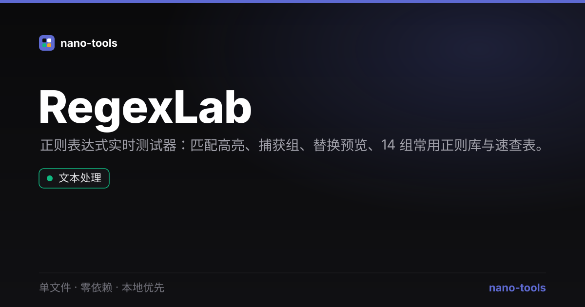

<p align="center">
  <a href="https://wangzifan396-wzf.github.io/WB/tools/RegexLab/"></a>
  
  
  
  
  
  
  
</p>

<p align="center">
  <a href="https://wangzifan396-wzf.github.io/WB/tools/RegexLab/"><strong>🌐 在线试用 Live Demo</strong></a>
</p>
<p align="center"></p>

---

# RegexLab · 正则表达式实时测试器

边写边高亮的正则表达式测试器。单文件、零依赖、纯本地运行，打开 `index.html` 即用，所有文本不上传。

## ✨ 功能

- **实时高亮** — 输入正则，测试文本中的匹配即时高亮，相邻匹配交替配色便于区分
- **捕获组解析** — 展示每处匹配的位置、编号捕获组与命名组 `(?<name>…)`
- **flags 开关** — `g` `i` `m` `s` `u` `y` 一键切换，实时生效
- **替换预览** — 支持 `$1` `$2` `$<name>` 引用，实时看到替换结果
- **常用正则库** — 邮箱 / URL / 手机号 / IPv4 / 日期 / 颜色 / 中文等 14 组，点击即填
- **速查表** — 常用元字符、量词、断言一览
- **暗 / 亮主题**，偏好本地记忆

## 🚀 使用

直接下载 `index.html` 双击打开，或访问 [在线 Demo](https://wangzifan396-wzf.github.io/WB/tools/RegexLab/)。

## 🧪 测试

核心逻辑为纯函数，可离线单测：

```bash
node _test.js
```

## 🛠 技术

原生 `RegExp`（ECMAScript 语法）+ Vanilla JS，无任何构建步骤与外部依赖。

## 📄 License

MIT
