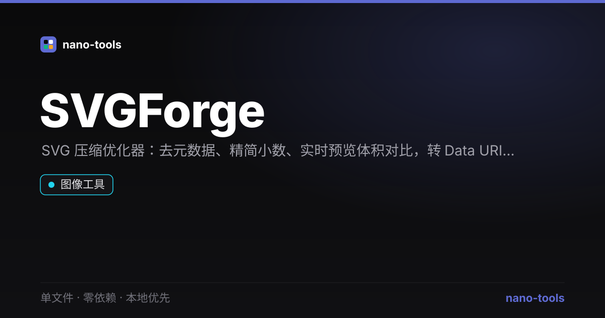

<p align="center">  
</p>
# SVGForge

> 离线优先的 SVG 压缩优化器 —— 去注释/元数据、精简小数、实时预览，一键转 Data URI 与 CSS background。

[](https://github.com/wangzifan396-wzf/WB/tree/main/tools/SVGForge/stargazers)
[](https://github.com/wangzifan396-wzf/WB/tree/main/tools/SVGForge/network/members)
[](https://github.com/wangzifan396-wzf/WB/tree/main/tools/SVGForge/issues)
[](https://github.com/wangzifan396-wzf/WB/tree/main/tools/SVGForge/commits/main)
[](https://github.com/wangzifan396-wzf/WB/tree/main/tools/SVGForge)
[](LICENSE)

🌐 **在线试用：** https://wangzifan396-wzf.github.io/WB/tools/SVGForge/

## 特性
- **零依赖、单文件**：只有 `index.html`，双击即用。
- **本地优先**：优化在浏览器内完成，SVG 不上传。
- **压缩优化**：去 XML 声明 / DOCTYPE / 注释 / metadata / title / desc，折叠空白，精简坐标小数（精度可调）。
- **实时预览 + 体积对比**：原始 / 优化后字节数与节省百分比。
- **多种输出**：优化 SVG 源码、Data URI、CSS `background-image`。
- **明暗主题**。

## 使用
粘贴 SVG 源码，调整小数精度与元数据选项，右侧即时预览并显示节省比例，选择输出格式后复制或下载。

> 注：为最大化压缩，标签间空白会被折叠——若 SVG 内含需要保留空格的 `<text>` 文本，请自行核对。

## 技术栈
纯 HTML + CSS + 原生 JS，优化逻辑为手写正则实现，无任何第三方库。

## 测试
```bash
node _test.js   # 纯函数单测（strip/round/collapse/dataURI）+ jsdom 功能测试
```

## License
[MIT](LICENSE)
