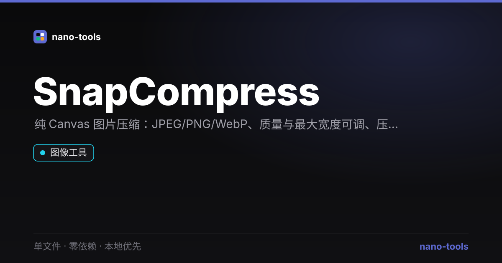

  
  
  
  
  
  
  
  

  <a href="https://wangzifan396-wzf.github.io/WB/tools/SnapCompress/"><strong>🌐 在线试用 Live Demo</strong></a>

---

# SnapCompress · 本地图片压缩器

单文件、零依赖、本地优先的**图片压缩器**。拖入或选择图片，调整格式与质量，浏览器内即时压缩。零上传、零依赖、打开即用，隐私安全。

## ✨ 功能
- **拖拽 / 多选**：支持一次加入多张图片
- **输出格式**：JPEG / PNG / WebP
- **质量滑块**（1–100，PNG 不受质量影响）
- **最大宽度**限制（等比缩放，0 = 不限制）
- **前后体积对比**与节省百分比、整体统计
- **批量压缩 + 单张下载**

## 🚀 使用
直接双击 `index.html`。点击或拖入图片 → 设格式/质量 → 「压缩全部」→ 下载。

## 🧩 技术说明
- 纯原生 HTML / CSS / JS，**零第三方依赖**，单文件自包含
- 压缩走浏览器 `Canvas`（`drawImage` + `toBlob`），**无需后端、图片不上传**
- 辅助逻辑为纯函数（`formatBytes` / `extToMime` / `computeScale` / `qualityFor` / `savings`），可在 Node 下单测（`node _test.js`，19 项断言）

## ⚠️ 说明
- WebP 编码依赖浏览器支持（现代浏览器均支持）；个别环境不支持时会给出提示。
- 压缩为计算密集型操作，纯前端完成，大图请耐心等待。

## 📄 许可
MIT
